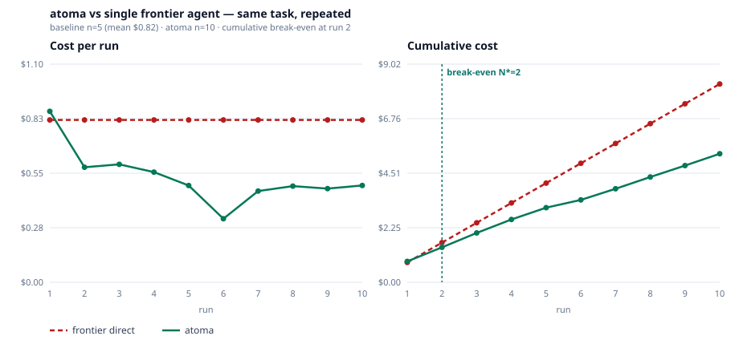

<div align="center">

# ⚛️ atoma

### An AI agent platform that pays for the frontier model **once per task**, not once per step.

*Most agent systems run every step of every task on the most expensive model. atoma spends
frontier reasoning on the decomposition alone and pushes the rest — routing, execution,
verification — down to models that cost a fraction as much.*


**[→ How it works, in detail](docs/how-it-works.md)**

</div>

---

## The problem this addresses

An AI agent that writes software costs money every time it thinks. Today that bill has an
uncomfortable shape:

- **It does not improve.** The thousandth invoice-parser looks exactly as expensive as the first.
  Nothing the system learned on task 999 makes task 1000 cheaper.
- **It is unpredictable.** On the same task, on the same model, a single frontier agent's cost
  varied by **2.1×** between rounds measured 22 hours apart — depending on how long the model
  chooses to think. That is hard to put in a client proposal.
- **It cannot prove its work.** The agent that did the job is usually also the one that certifies
  it. For anything billable, self-certification is not evidence.

For a consultancy or a product team, this makes agent automation a variable cost that scales
linearly with delivery — the opposite of the software economics that justified building it.

## Where the money actually goes

One measured run of the same maintenance task, both arms, [round 8](benchmark/ROUND8.md):

| | frontier calls | **frontier cost** | cheap-model cost | total |
|---|---|---|---|---|
| single frontier agent | 1 | **$0.820** | — | $0.820 |
| atoma, warm | 1 | **$0.027** | $0.192 | $0.219 |

The baseline does the whole job inside one frontier call: read the files, edit, run five
verification commands, rewrite the docs. Every tool result stays in the conversation and is
re-billed at frontier rates on every subsequent turn.

atoma pays the frontier model **only to decompose the goal** — one call, $0.027 — and hands the
execution to a cheap model. **A ~30× reduction on the expensive line item** is where the saving
comes from. Everything below is that fact, measured repeatedly.

## The approach

Three mechanisms. The first two carry the result; the third is real but has not yet paid.

**1. The cheapest model that can answer, answers.**
An expensive model decomposes the goal into phases, a mid-tier model routes each phase, and a
cheap model does the file-writing and command-running. This is structural, not a guideline —
only the bottom tier is given tools on the supervised path. A yes/no check never runs on a
reasoning model.

**2. Components earn trust, and can lose it.**
Every reusable component carries a success/failure record. Once one has a clean track record the
system stops paying a model to review its output — but it still runs a zero-token ground-truth
probe against the artefact first, because the component nobody watches is exactly the one that
needs watching. One failure revokes trust automatically.

**3. What proves repeatable gets compiled away — a correct mechanism that does not yet pay.**
When the system solves a novel task it writes the pattern down as a recipe; a recipe that keeps
working is compiled into a script that runs with zero model calls. The compiler *refuses*
patterns needing judgment, and records why — verbatim, from a benchmark run:

> *"designing a hand-written state-machine parser and type-inference/stats engine tailored to
> whatever edge cases a given spec names … is an irreducible per-task design/reasoning act that
> cannot be replaced by a fixed deterministic script without hardcoding one particular grammar."*

**Eight controlled rounds have not shown this mechanism paying.** Across every committed atoma
row it fired once in 54 build runs, then 11 / 1 / 1 / 0 times across four maintenance rounds
(10 / 1 / 1 / 0 on the primary tasks alone). Round 5 shipped seven wrong deliverables out of
nine. Each fix since made the path more correct and none made it cheaper; the best remaining
idea was designed, measured at a **$0.03/run ceiling** and
[refused](docs/hybrid-skills-design.md). It is kept because it is sound and cheap to carry, not
because it is load-bearing. Mechanisms 1 and 2 are the product.

## The controlled experiment

The same task, from an **empty registry and empty skill store**, given to atoma and to a single
frontier agent — same sandbox, same tools, same budget, same token accounting,
[registered before each run](benchmark/PROTOCOL.md). Eight rounds: four on a from-scratch build,
four on a maintenance task.


<sub>Round 1 only. Later rounds are in `benchmark/results-round{2..8}.csv`.</sub>

Mean cost per run on each round's main task, each against **its own same-day control**:

| | R1 | R2 | R3 | R4 | | R5 | R6 | R7 | R8 |
|---|---|---|---|---|---|---|---|---|---|
| | *build task* | | | | | *maintenance task* | | | |
| frontier direct | $0.82 | $1.01 | $1.68 | $1.10 | | $0.71 | $0.58 | $0.58 | $0.82 |
| **atoma** | **$0.53** | **$0.54** | **$0.51** | **$0.47** | | **$0.20** | **$0.28** | **$0.59** | **$0.31** |
| ratio | 1.54× | 1.89× | 3.33× | 2.35× | | 3.57× | 2.05× | **1.00×** | 2.62× |
| control arm *n* | 5 | 3 | 3 | 2 | | 2 | 2 | 2 | **1** |

**Read the two weak rounds, not just the strong ones.** Round 7 shows **no saving at all** — an
earlier sequential phase had already applied the edit, then validators repeatedly rejected a
later phase for honestly reporting the work already satisfied. That rare semantics gap cost
$0.33/run in escalation churn until it was [diagnosed and fixed](benchmark/ROUND7.md). Round 8's
control arm is a **single observation**: its
second run lost its LLM connection, so its cost is unrecoverable (the deliverable was correct).
Round 5's 3.57× is the round whose deliverables were later found wrong — see below.

**The frontier baseline is volatile; atoma is not.** Across the four build rounds the control
swung **2.1×** ($0.82 → $1.68) while atoma stayed inside **$0.47–0.54**. atoma exposes one
frontier call in roughly fifteen, so frontier variance is diluted; a single-agent baseline is
exposed end to end and passes it straight through. That was never the hypothesis — it fell out of
a confounder the protocol registered in advance, and it is the most reproducible result of the
eight.

| | frontier direct | atoma |
|---|---|---|
| A *novel* task in the same family | $1.18 <sub>(n=2, spanning 2.5×)</sub> | **$0.18–0.55, zero new recipes learned** |
| Deliverable correctness, executing scorer <sub>(R1 · R2 · R3 · R8)</sub> | 7/7 · 3/3 · 3/3 · 2/2 | **12/12 · 16/16 · 16/16 · 7/7** |

Generalisation is the claim that has held most consistently: **eleven held-out runs across eight
rounds, all in the same family as the trained task, all needing zero new recipes.** The frontier
comparison for it rests on two observations from round 1 and should be read as indicative.

Correctness is scored by [an executing scorer run outside both arms](benchmark/verify-maint.mjs)
— it runs the artefact rather than reading claims about it. **Rounds 4–7 have no committed
scorer output**, so their correctness figures are not reproducible from this repo; rounds 1–3 and
8 are. That gap is recorded rather than papered over.

**One headline in this table used to be wrong, and how it was caught matters more than the
number.** Round 5 measured 4.7× — and the independent scorer found **7 of 9 deliverables shipping
a README that contradicted the artefact it documented**. A compiled verifier had been handed an
*"update README.md"* subtask, replayed its manifest, reported success and written nothing; the
guard meant to catch that only checked whether named files *exist*, which is inert when every
file was seeded. With the guard fixed, correctness went to 5 of 6 and the ratio fell to 2.05×.
Half the original headline was work that had not happened. The pipeline's own "delivered" banner
never noticed.

## The longer-run picture

Beyond the controlled experiment, `burnin/results.csv` holds 156 runs across 8 task families,
regenerable with `npm run burnin`.

| | |
|---|---|
| Runs recorded | **156** across 8 task families |
| Delivered successfully | **150 — 96.2%** |
| Cost per delivered run | median **$0.33**, mean $0.37 |
| Cheapest *delivered* run | **$0.126 · 132s** |
| Runs containing at least one zero-model-call phase | **45 of 156** — median $0.26 · 227s |
| Expensive-model calls per run | **1** on the normal path (148 of 150 delivered runs) |

### Three honest readings

**The batch average across those 156 runs does not fall, and that is expected.** It is not the
same measurement as the experiment above. Cost falls on a *repeated* task; the batch curve is
flat-to-rising because the task generator deliberately proposes harder, novel work each round.
Read the controlled experiment for the amortisation claim and this corpus for breadth — not the
other way round.

**The zero-cost mechanism applies to *phases*, and it is not what makes atoma cheaper.** No
complete run has ever cost $0.00, and none can today: every run still pays for one top-level
planning call. 45 of 156 corpus runs contain a phase that executed with no model call — but those
runs' mean cost is $0.37, identical to the corpus mean, and in the controlled rounds the compiled
path fired 14 times in 8 rounds, 11 of them in the single round whose deliverables were wrong.
The saving comes from tiering and earned trust.

**Failure handling improved measurably.** Runs needing corrective intervention fell from **28 of
the first 52** to **zero in the last thirty**. That is a learning curve being paid down.

## What it builds today

Verified across 156 runs: **single-page web applications**, **zero-dependency HTTP JSON APIs**,
**command-line tools**, and **technical documentation** — each delivered into an isolated
workspace with a machine-readable record of every command that was run to verify it.

It is a **framework for building such systems**, not a finished product. There is no hosted
service, no user accounts, no multi-tenancy — see [Status](#status) below.

## Why a technical buyer should look closer

- **Every claim is auditable.** Each run leaves a full JSON trace: every model call with its
  prompt, response and token count, every file written, every trust decision. A built-in web
  console replays any run end to end.
- **Verification does not trust the worker.** Before accepting a result the supervisor re-reads
  the files from disk, checks quoted content against what the file actually contains, loads the
  page in a real browser, and cross-checks the machine-readable record of the commands the worker
  ran. It never re-runs those commands itself — that was considered and rejected, and the reason
  is written down. This costs no tokens and it runs *even on the most-trusted path*.
- **The engineering record is unusually explicit.** `AGENTS.md` documents not only what the
  system does but which observed failure motivated each mechanism, and a "considered and
  rejected" section records optimisations that were designed, measured, and refused. Reversals
  are recorded rather than quietly deleted — including several in the benchmark above.
- **Vendor-flexible.** The same code runs against the Anthropic API, a Claude subscription, local
  models via Ollama, Z.ai, or a ChatGPT subscription through Codex for supervisor tiers — and can
  mix vendors per tier, e.g. a cheap third-party model for execution while planning stays on a
  frontier model.

## Evaluate it in ten minutes

```bash
npm install
npm run typecheck && npm test     # 1236 tests, no API key needed. Model calls are mocked,
                                  # but the suite drives a real headless browser and real
                                  # local servers. 6 further tests need Docker and the
                                  # worker image (npm run build:worker) — they skip without.

# one real task, pick your auth:
ANTHROPIC_API_KEY=... npm run run:build "a Node CLI that converts CSV to JSON"
ATOMA_LLM=claude-cli  npm run run:build "…"    # Claude subscription, no API key

npm run viz                       # replay that run: every call, every cost, every decision
npm run skills -- list            # what it learned, and what it refused to compile
npm run burnin                    # regenerate the economics table above
```

A fresh clone starts with **no learned state at all** — the catalogue, the recipes and the
traces are runtime data, deliberately not committed. What you clone is the framework; the
experience is earned on your own machine, which is what makes the cost curve verifiable rather
than asserted.

## Drive it from the agent you already use (MCP)

atoma exposes itself as an [MCP](https://modelcontextprotocol.io) server, so an existing agent can
hand it a task and read back what the system has learned. One line registers it:

```bash
claude mcp add atoma -- npx tsx "$PWD/src/mcp/server.ts"   # then start a new session
```

**Thirteen tools.** One starts a run and returns immediately with an id to poll; one cancels a run;
the other eleven are read-only — the atom catalogue with its earned trust, the recipe library and
its lifecycle, the audit ledger's integrity projection, run traces, and the tool-friction report.
The caller pays for one tool call and atoma does the tiering.

**It speaks over standard input, and refusing a port is the security argument rather than a
limitation.** A run reaches the shell and the network by design, so the party a launch endpoint
would have to defend against is *the run itself* — which is why the web console describes task
families but deliberately will not start one, and why the list of controls that would make an HTTP
endpoint safe is written down instead of implemented. A server on stdio hands the run no socket, so
the question does not arise.

Two properties are declared to the host rather than left to be discovered: starting a run is
**destructive** — it archives the shared workspace unless told otherwise, and it mutates the
catalogue, the recipe store and the ledger — and runs are **serialised**, because concurrent runs
share one workspace and would yield plausible-looking wrong economics instead of an error. The
slot is a cross-process lease, not just server memory; cancellation keeps it until the detached
child has actually exited and the trace has closed.

## Status

**Working research system, honestly labelled.** ~25,000 lines of strict TypeScript, 1242 tests,
seven runtime dependencies, Node 20.19+, 22.13+, or 24+.

What exists: the full three-tier loop, the learning and compilation lifecycle, sandboxed
execution with opt-in container isolation and proxied egress, an append-only audit ledger with
integrity checking, a web console, and a measurement harness.

What does not: any notion of tenants, users or authentication, and no hosted service. This is a
private repository, shared deliberately rather than published. The target multi-tenant design is
written up in
[`docs/saas-architecture.md`](docs/saas-architecture.md) and explicitly marked as not built.

**[→ How it works: components, flows and diagrams](docs/how-it-works.md)**

---

<div align="center">
<sub>TypeScript · SQLite · Node 20.19+ / 22.13+ / 24+ · the corpus table regenerates with <code>npm run burnin</code>;
the controlled rounds are in <code>benchmark/</code></sub>
</div>
