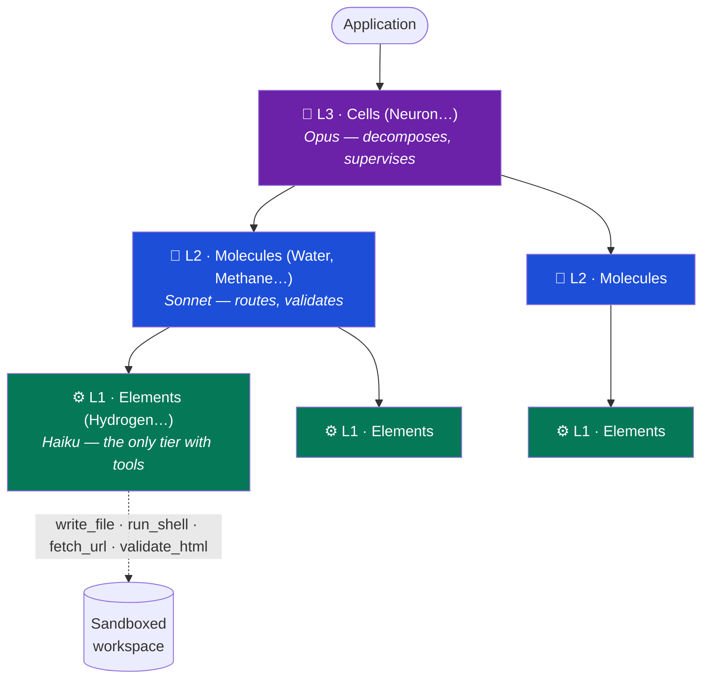
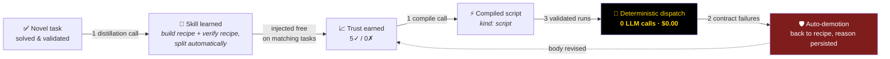

<div align="center">

# ⚛️ atoma

### The cheapest model that can do the job, does the job.<br/>The expensive ones only think.

*A self-optimizing, three-tier LLM agent framework that turns every task it solves<br/>into a cheaper way to solve the next one — all the way down to **zero tokens**.*


</div>

---

## 💸 The problem

Agent systems burn money in one direction: **everything runs on the biggest model, forever.**
Every task is solved from scratch, every verification is another LLM call, and nothing the
system learns ever makes the next run cheaper. Costs scale linearly with usage — the exact
opposite of software economics.

## ⚛️ The thesis

**atoma inverts that curve.** Intelligence is spent once, at the top; execution gets
progressively compiled away. Three mechanisms compound:

1. **Tiered dispatch** — frontier models plan, cheap models execute, validation is a
   yes/no on the cheapest tier. Structural, not aspirational: only L1 can even hold tools.
2. **Earned trust** — every atom and every learned skill carries success/failure counters.
   Trusted components skip validation; broken ones lose their status automatically.
3. **Skill compilation** — recurring patterns are distilled into recipes, and recipes that
   prove mechanical are **compiled into deterministic scripts that run with zero LLM calls**.

```
        cost per task
        │██████████        run 1     — frontier model plans, learns a skill
        │██████            runs 2-5  — skill injected, cheap tier executes
        │███               run 6     — skill compiled to a script (one-time)
        │                  runs 7-∞  — deterministic dispatch: $0.00, ~2s
        └──────────────────────────▶ experience
```

## 📊 Measured, not promised

Every number below comes from live runs recorded in `./runs` (traces, tokens, costs).

| Metric | Value |
|---|---|
| Full CLI deliverable (build + harden + document + **re-verify**) | **~$0.50 / run** |
| Frontier-model (Opus) calls per run | **exactly 1** (the plan — by design) |
| Mature-pattern subtask, L2 happy path | **$0.05** (was $0.18 before prefilters — 0 Opus, 0 Sonnet) |
| Prompt-cache hits per run | **0.8 – 1.7M tokens** at 10% input price |
| Learned task on a trusted compiled skill | **$0.00 — zero LLM calls**, 2 tool calls |
| Broken deliverable detected by the compiled verifier | **exit 1, per-command diff** (mutation-tested) |

## 🥊 Head-to-head: atoma vs frontier-direct

Same task **verbatim**, same sandbox, same 9 tools, same transport and token
accounting on both sides. The baseline is Opus 5 as a single tool-loop agent with
a competent generic engineer prompt, default settings — what a from-scratch user
gets. Every deliverable was verified by hand on both sides.

| Task | atoma's learning maturity | atoma | Opus 5 direct | Cost verdict |
|---|---|---|---|---|
| `colstat` CLI | **mature** (2 trusted compiled skills) | **$0.226** ✓ | $1.061 ✓ | **atoma 4.7×** |
| `linefreq` CLI | mature | **$0.205** ✓ *(2 phases at $0.00)* | $0.302 ✓ | **atoma 1.5×** |
| Pomodoro web app | immature (no relevant skill) | $0.852 ✗ *timeout* | **$0.498** ✓ | **Opus — outright** |
| `todos` HTTP API | immature | $0.399 ✓ *(+2 skills learned)* | **$0.223** ✓ | Opus 1.8× |

Three honest readings:

1. **The cost advantage tracks learning maturity exactly.** On the family with
   9 runs of experience, atoma beats frontier-direct 1.5–4.7× — *with independent
   validation and a deterministic re-verifier on top*, while the baseline can only
   self-certify.
2. **Immature families pay tuition — and the tuition becomes an asset.** The
   `todos` run cost $0.18 more than the baseline and *learned two skills during
   the benchmark itself*; the CLI family rode that same mechanism from $0.66 down
   to $0.21. The Pomodoro loss is real and diagnostic: the web bucket has the most
   expensive verification loop and no learned recipes yet — it is the designated
   next milestone (a probe-manifest equivalent for browser evidence).
3. **Frontier-direct cost is wildly variant** ($0.22–$1.06 on comparable tasks —
   thinking depth is unpredictable), while mature atoma is stable at $0.20–0.23.
   For billable production, cost *predictability* matters nearly as much as the mean.

## 🏗️ Architecture

Every *atom* is an LLM-backed agent. Three tiers, one shared supervision protocol,
one persisted registry.



- **Fractal creation** — the app creates L3, L3 creates L2, L2 creates L1. Every type is
  persisted in a SQLite registry with version history and reused across runs.
- **One supervision loop** — `plan → validate → execute → validate`, identical at every
  parent→child link. Rejections carry typed mutations (`ephemeral` / `patch` / `branch`);
  repeated failure escalates and *breeds a corrected child type*.
- **Cheap-first gating** — before any expensive plan call, a Haiku prefilter scans the
  catalog for a reuse match and can short-circuit the entire reasoning step.

## 🔁 The economic flywheel



The flywheel is **asymmetric by design**: promotion must be earned twice (recipe trust,
then script trust — counters reset at compile time), while demotion takes exactly two
deterministic failures. A wrong script can never entrench itself; a right one converges
to free.

**What compiles, compiles honestly.** The compiler refuses recipes that require judgment —
verbatim refusal from a live run, persisted to disk:

> *"…designing bespoke CLI business logic from a free-form natural-language spec is an
> irreducible LLM reasoning step, not a deterministic recipe."*

Verification workflows, scaffolds, probe matrices — the mechanical half of every job —
compile. Creative work stays on the LLM path. The system knows the difference and
**writes down why**.

## 🔬 Trust is earned, never assumed

The most-trusted component is precisely the one nobody watches — so atoma watches it
structurally:

- **Ground-truth probes** — validators receive *evidence*, not narration: files re-read
  from disk, real page loads, recorded `{cmd, exitCode, stdout}` probes. Trusted
  fast-paths still run the (token-free) probe before approving.
- **Machine-readable verification** — deliverables ship with `.atoma-probes.json`, a
  manifest of every verified invocation. Compiled verifiers re-run it and diff
  byte-for-byte. *Mutation-tested: break the artefact, the verifier fails it.*
- **Sandboxed execution** — filesystem jail with symlink containment, child-process env
  allowlist (secrets physically absent from anything the model spawns), executor-level
  tool-scope enforcement.
- **Full observability** — every LLM call, tool call, registry mutation and skill event
  is recorded per run; a built-in web visualizer replays any run end-to-end.

## 🔌 Runs on your terms

| Provider | What it means |
|---|---|
| **Anthropic API** | Haiku 4.5 / Sonnet 5 / Opus 5, prompt caching, adaptive-thinking budgets managed |
| **Claude Code CLI** | Runs on a Claude **subscription** — no API key, tools bridged in-process via MCP |
| **Ollama** | Fully local / self-hosted models, same call-graph discipline |

One interface (`LlmClient`), three transports, identical safety contracts.

## 🚀 Quickstart

```bash
npm install
npm run typecheck && npm test          # 650 tests, all mocked — no API key needed

# live, pick your auth:
ANTHROPIC_API_KEY=... npm run example:build "a Node CLI that converts CSV to JSON…"
ATOMA_LLM=claude-cli  npm run example:build "…"    # Claude subscription, no key

npm run viz          # replay any recorded run in the browser
npm run registry -- list             # inspect the persisted atom taxonomy
npm run skills -- list               # inspect learned skills, trust counters, refusals
```

## 📁 Layout

- `src/core/` — types, base `Atom`, `superviseLoop` with escalation, LLM clients
  (Anthropic with tool-use loop + rolling cache breakpoint, Ollama, Claude Code CLI),
  cost/metrics
- `src/registry/` — SQLite registry, tier taxonomies (elements / molecules / cells)
- `src/atoms/` — concrete `L1Atom`, `L2Atom`, `L3Atom`, capability buckets, cost gates
- `src/skills/` — filesystem-backed skill store (recipes, compiled scripts, trust counters)
- `src/tools/` — `ToolSandbox` + built-in toolbox (`write_file`, `edit_file`, `read_file`,
  `list_files`, `run_shell`, `start_static_server`, `validate_html`, `fetch_url`,
  `start_node_server`)
- `src/viz/` — run recorder + self-contained web visualizer (`npm run viz`)
- `src/examples/` — `research-brief.ts` and `build-app.ts` (end-to-end build demo)
- `tests/` — vitest unit + integration tests (mock LLM, no network)

## 🗺️ Where this goes

- **Today** — self-optimizing task execution with compounding cost decay, live-validated
  on real deliverables (web artefacts, HTTP APIs, CLIs, documentation).
- **Next** — richer compiled-skill library, cross-project skill sharing, registry
  rollback tooling.
- **The bet** — agent platforms will be judged on **marginal cost per solved task**.
  atoma is built so that number trends to zero.

---

<div align="center">
<sub>TypeScript · SQLite · zod · 650 tests · three LLM transports · every claim above is reproducible from <code>./runs</code></sub>
</div>
