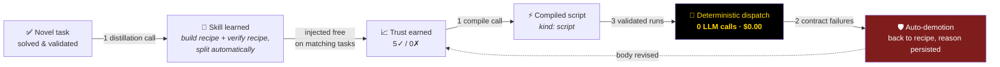

<div align="center">

# ⚛️ atoma

### The cheapest model that can do the job, does the job.<br/>The expensive ones only think.

*A self-optimizing, three-tier LLM agent framework that turns every task it solves<br/>into a cheaper way to solve the next one — all the way down to **zero tokens**.*


</div>

---

## 💸 The problem

Agent systems burn money in one direction: **everything runs on the biggest model, forever.**
Every task is solved from scratch, every verification is another LLM call, and nothing the
system learns ever makes the next run cheaper. Costs scale linearly with usage — the exact
opposite of software economics.

## ⚛️ The thesis

**atoma inverts that curve.** Intelligence is spent once, at the top; execution gets
progressively compiled away. Three mechanisms compound:

1. **Tiered dispatch** — frontier models plan, cheap models execute, validation is a
   yes/no on the cheapest tier. Structural, not aspirational: only L1 can even hold tools.
2. **Earned trust** — every atom and every learned skill carries success/failure counters.
   Trusted components skip validation; broken ones lose their status automatically.
3. **Skill compilation** — recurring patterns are distilled into recipes, and recipes that
   prove mechanical are **compiled into deterministic scripts that run with zero LLM calls**.

```
        cost per task
        │██████████        run 1     — frontier model plans, learns a skill
        │██████            runs 2-5  — skill injected, cheap tier executes
        │███               run 6     — skill compiled to a script (one-time)
        │                  runs 7-∞  — deterministic dispatch: $0.00, ~2s
        └──────────────────────────▶ experience
```

## 📊 Measured, not promised

Every number below comes from live runs — per-call timings, tokens and costs are in
each run's trace, and the whole table regenerates with `npm run burnin`.

| Metric | Value |
|---|---|
| **Day one** (fresh clone, empty registry): full CLI deliverable | **$0.37** — bootstrap + plan + build + learn |
| Same task, **second run** (skills matched, trust earned) | **$0.22 · 138s** wall |
| Frontier-model (Opus) calls per run | **exactly 1** (the plan — by design) |
| Mature-pattern subtask, L2 happy path | **$0.05** (was $0.18 before prefilters — 0 Opus, 0 Sonnet) |
| Prompt-cache hits per run | **0.2 – 1.7M tokens** at 10% input price |
| Decomposable task → 3 deliverables in **parallel branches** (measured over 6 runs / 18 tools) | $0.40/run = **$0.13 per deliverable** — the fan-out amortizes the plan |
| HTTP family, batch mean: first exposure → after compilation | **$0.341 → $0.248** (−27%), dispatch on every run |
| Learned task on a trusted compiled skill | **$0.00 — zero LLM calls**, 2 tool calls |
| Families that reached compiled-skill dispatch | **CLI + HTTP** (docs, CLI verification, API probing) |
| Mature HTTP run (2 compiled phases, 0 Sonnet) | **$0.126 · 132s** — cheapest measured run |
| Broken deliverable detected by the compiled verifier | **exit 1, per-command diff** (mutation-tested) |
| Full state wipe → relearn, three separate epochs | **same decay trajectory every time** |

## 🥊 Head-to-head: atoma vs frontier-direct

Same task **verbatim**, same sandbox, same 9 tools, same transport and token
accounting on both sides. The baseline is Opus 5 as a single tool-loop agent with
a competent generic engineer prompt, default settings — what a from-scratch user
gets. Every deliverable was verified by hand on both sides.

| Task | atoma's learning maturity | atoma | Opus 5 direct | Cost verdict |
|---|---|---|---|---|
| `colstat` CLI | **mature** (2 trusted compiled skills) | **$0.226** ✓ | $1.061 ✓ | **atoma 4.7×** |
| `linefreq` CLI | mature | **$0.205** ✓ *(2 phases at $0.00)* | $0.302 ✓ | **atoma 1.5×** |
| Pomodoro web app — 1st attempt | immature (no relevant skill) | $0.852 ✗ *timeout* | **$0.498** ✓ | **Opus — outright** |
| Pomodoro web app — 4th attempt | after 2 learned recipes + 3 platform fixes | **$0.537** ✓ *0 escalations* | $0.498 ✓ | parity |
| `todos` HTTP API | immature | $0.399 ✓ *(+2 skills learned)* | **$0.223** ✓ | Opus 1.8× |

Reproduce it: `npm run burnin` replays a task batch through the real pipeline and
appends each run's economics to `burnin/results.csv` — the curve is a regenerable
measurement, not a session anecdote, and it renders live in the viz's **Burn-in** tab.

Three honest readings:

1. **The cost advantage tracks learning maturity exactly.** On the family with
   9 runs of experience, atoma beats frontier-direct 1.5–4.7× — *with independent
   validation and a deterministic re-verifier on top*, while the baseline can only
   self-certify.
2. **Immature families pay tuition — and the tuition becomes an asset.** The
   `todos` run cost $0.18 more than the baseline and *learned two skills during
   the benchmark itself*; the CLI family rode that same mechanism from $0.66 down
   to $0.21. The Pomodoro arc shows the failure-driven half of the loop: attempt
   1 lost outright, but each loss converted into a durable fix — two learned
   recipes (smoke-test thrash: 34 browser probes → 4), an orphan-process kill
   fix, and an evidence contract the web tier had never been given. Attempt 4
   delivered at **$0.537 with zero escalations** — cost parity with
   frontier-direct on the family's *first-ever* success, before any trust or
   compilation has accrued.
3. **Frontier-direct cost is wildly variant** ($0.22–$1.06 on comparable tasks —
   thinking depth is unpredictable), while mature atoma is stable at $0.20–0.23.
   For billable production, cost *predictability* matters nearly as much as the mean.

*The benchmark's trained state (compiled skills, mature counters) is preserved under
the `trained-snapshot` git tag; the repo itself ships clean — see the lifecycle note
below.*

## 🧬 The repo is the framework; learned state is runtime data

`skills/`, the registry DBs and the run traces are **gitignored by design**: they
mutate on every run, and they are the system's memory, not its source. A fresh clone
starts at day zero and earns its own state — a property we validate by wiping
everything and re-running from scratch. Four full epochs so far, same trajectory
each time: bootstrap the canonical atoms, learn a build+verify skill pair on the
first novel task (one distillation call produces both), reuse them intra-run, then
watch the per-task cost fall. Epoch 4 traversed the ENTIRE lifecycle hands-off in
one batch — nine runs, zero operator-touched counters: cold start $0.285 → skills
matched → validators retired at 3✓ → at 5✓ the compiler REFUSED the build recipe
("designing bespoke CLI business logic from a free-form spec is an irreducible LLM
reasoning step") and PROMOTED the verify recipe → the script earned 3 clean runs
under the validated loop → zero-LLM dispatch. The `trained-snapshot` tag archives
a fully-matured store for inspection or restoration.

Recent transport engineering, measured on the same warm task:

| Fix | Effect |
|---|---|
| `effort` pin through the Claude Code CLI (its `maxTokens` is advisory-only) | skill-compile calls: ~7 min → ~1 min |
| Thinking parity for Haiku-tier calls (the CLI defaulted thinking ON; the API never asks) | prefilters **17.5s → 4.4s/call**; whole run **250s → 138s (−45%)** |
| Transport-aware run budgets, orphan-process group-kill, config-failure batch abort | no more phantom rows, port squatters, or deadline-starved compiles |
| Post-approval bookkeeping (distillation, compilation) on its own abort budget | learning is never discarded to protect a deadline the deliverable already met |
| Refusal stamps carry the compile-prompt generation | an evolved compiler automatically re-earns its shot — no operator reset |
| Demotion stamps the generation that COMPILED the failing script | a fix to the compiler is never blocked by the failure of a pre-fix artifact |
| Probe manifest health-checked; both shell and http entry shapes specified | the machine interface between prompt-written evidence and compiled readers holds |

## 🧱 Architecture retrofit (2026-08): contracts, ledger, provenance

Seven greenfield principles, retrofitted without a rewrite: a
`src/contracts/` module now owns every inter-agent shape (manifest
entries, script envelope, typed witnesses) with prompts *generated from
schema-validated examples* — the one-sided-contract bug class is closed
structurally; every lifecycle mutation appends to an **append-only
ledger** (`npm run ledger -- check` flags any counter a write path
bypassed); skill bodies carry **provenance** (who wrote them, which
compiler compiled them — surviving counter bumps and resets); budgets
are **per concern** (deliverable / bookkeeping / verification); tier
code is verifiably SDK-free; and L2Atom shed 2,100 lines (3,692 → 1,565, −58%) into lifecycle/verdict/dispatch/probes modules, including
`groundTruth.ts` (zero-LLM evidence machinery) and `compilePrompt.ts`.

## 🔧 What hardening looks like here

Most of the engineering in this repo is not features — it is closing the gap
between "the mechanism works" and "the mechanism cannot be fooled by reality".
A representative sweep, every item triggered by an observed live failure:

| Symptom in the wild | What it exposed | Fix |
|---|---|---|
| A skill stayed parked after the compiler improved | Refusal stamps assumed a fixed compiler | Stamps carry the compile-prompt **generation**; a newer compiler re-earns its shot |
| …and the demotion re-parked it | The stamp recorded *when*, not *what compiled* | Demotion stamps the generation that **produced the failing script** |
| A compiled verifier crashed on `entry.cmd` | The manifest contract was taught to writers only | Compiler learns **all three entry shapes**; validator too |
| A revision "fixed" nothing but cleared the stamp | An unchanged body was treated as a change | Unchanged revisions are a no-op, guard intact |
| A compile died to the run deadline (3×) | Post-approval work shared the deliverable's budget | Bookkeeping gets **its own** abort budget |
| A batch burned 5 tasks on a dead credential | The config guard only watched task #1 | Streak-based abort at **any** position |
| The viz polled a dead run forever | "No endedAt" was read as "still alive" | **Abandoned-run** detection by last activity |
| One web run recorded `{x:304,y:392}`, another `{selector:"#toggle"}` | The tool accepts coordinates; the contract never forbade them | Manifest interactions must be **selector-based** — validated |

Each one is a test in the suite, and most are a paragraph in `CLAUDE.md`
explaining the failure that motivated it — so the reasoning survives the
commit that fixed it.

## 🏗️ Architecture

Every *atom* is an LLM-backed agent. Three tiers, one shared supervision protocol,
one persisted registry.


- **Fractal creation** — the app creates L3, L3 creates L2, L2 creates L1. Every type is
  persisted in a SQLite registry with version history and reused across runs.
- **One supervision loop** — `plan → validate → execute → validate`, identical at every
  parent→child link. Rejections carry typed mutations (`ephemeral` / `patch` / `branch`);
  repeated failure escalates and *breeds a corrected child type*.
- **Cheap-first gating** — before any expensive plan call, a Haiku prefilter scans the
  catalog for a reuse match and can short-circuit the entire reasoning step.

## 🔁 The economic flywheel



The flywheel is **asymmetric by design**: promotion must be earned twice (recipe trust,
then script trust — counters reset at compile time), while demotion takes exactly two
deterministic failures. A wrong script can never entrench itself; a right one converges
to free.

*Field-proven, autonomously:* when a workspace's module semantics broke a compiled
verifier (an ESM `package.json` turned the CommonJS scratch into a crash), the whole
safety stack executed by itself across two runs — dispatch → contract failure → failure
streak → demotion to the recipe → anti-recompile stamp with the reason persisted —
**with zero failed deliverables**: every run still shipped via the validated LLM
fallback while the system quarantined its own broken optimization.

**What compiles, compiles honestly.** The compiler refuses recipes that require judgment —
verbatim refusal from a live run, persisted to disk:

> *"…designing bespoke CLI business logic from a free-form natural-language spec is an
> irreducible LLM reasoning step, not a deterministic recipe."*

Verification workflows, scaffolds, probe matrices — the mechanical half of every job —
compile. Creative work stays on the LLM path. The system knows the difference and
**writes down why**.

## 🔬 Trust is earned, never assumed

The most-trusted component is precisely the one nobody watches — so atoma watches it
structurally:

- **Ground-truth probes** — validators receive *evidence*, not narration: files re-read
  from disk, real page loads, recorded `{cmd, exitCode, stdout}` probes. Trusted
  fast-paths still run the (token-free) probe before approving.
- **Machine-readable verification** — deliverables ship with `.atoma-probes.json`, a
  manifest of every verified invocation. Compiled verifiers re-run it and diff
  byte-for-byte. *Mutation-tested: break the artefact, the verifier fails it.*
- **Sandboxed execution** — filesystem jail with symlink containment, child-process env
  allowlist (secrets physically absent from anything the model spawns), executor-level
  tool-scope enforcement.
- **Full observability, including RIGHT NOW** — every LLM call, tool call, registry
  mutation and skill event is recorded per run; the built-in web visualizer replays
  any run end-to-end, shows a **live "happening now" banner** for in-flight calls
  (ticking elapsed, >120s flagged), marks calls a crash or network blip left
  unfinished as *interrupted*, and renders the burn-in cost curve in its own tab.
- **Operator tooling with an undo** — `registry history <name>` lists every archived
  version of an atom; `registry rollback <name> --to <v>` restores one exactly
  (append-only history, trust counters reset — a restored behaviour re-earns its
  reputation like any other change).

## 🔌 Runs on your terms

| Provider | What it means |
|---|---|
| **Anthropic API** | Haiku 4.5 / Sonnet 5 / Opus 5, prompt caching, adaptive-thinking budgets managed |
| **Claude Code CLI** | Runs on a Claude **subscription** — no API key, tools bridged in-process via MCP |
| **Ollama** | Fully local / self-hosted models, same call-graph discipline |

One interface (`LlmClient`), three transports, identical safety contracts.

## 🚀 Quickstart

```bash
npm install
npm run typecheck && npm test          # 717 tests, all mocked — no API key needed

# live, pick your auth:
ANTHROPIC_API_KEY=... npm run example:build "a Node CLI that converts CSV to JSON…"
ATOMA_LLM=claude-cli  npm run example:build "…"    # Claude subscription, no key

npm run viz          # replay any run — or watch a live one, in-flight calls included
npm run registry -- list             # inspect the persisted atom taxonomy
npm run registry -- history Hydrogen # archived versions; rollback --to <v> restores one
npm run skills -- list               # inspect learned skills, trust counters, refusals

npm run burnin       # run a task batch through the real pipeline and append
                     # per-run economics to burnin/results.csv — every batch
                     # extends the cost-decay curve, and each run matures the
                     # skill/trust counters as a side effect. The curve renders
                     # live in the viz's Burn-in tab.
npm run burnin -- my-tasks.json --family cli --timeout 900000
```

## 📁 Layout

- `src/core/` — types, base `Atom`, `superviseLoop` with escalation, LLM clients
  (Anthropic with tool-use loop + rolling cache breakpoint, Ollama, Claude Code CLI),
  cost/metrics
- `src/registry/` — SQLite registry, tier taxonomies (elements / molecules / cells)
- `src/atoms/` — concrete `L1Atom`, `L2Atom`, `L3Atom`, capability buckets, cost gates
- `src/skills/` — filesystem-backed skill store (recipes, compiled scripts, trust counters)
- `src/tools/` — `ToolSandbox` + built-in toolbox (`write_file`, `edit_file`, `read_file`,
  `list_files`, `run_shell`, `start_static_server`, `validate_html`, `fetch_url`,
  `start_node_server`)
- `src/viz/` — run recorder + self-contained web visualizer (`npm run viz`)
- `src/run/` — the generic runner (`runTask`), the `TaskProfile` contract and
  the per-family profiles under `src/run/profiles/`
- `src/examples/` — `build-app.ts`, the build-family entrypoint (a thin shell
  over `runTask`)
- `tests/` — vitest unit + integration tests (mock LLM, no network)

## 🗺️ Where this goes

- **Today** — self-optimizing task execution with compounding cost decay, validated
  across three from-scratch epochs on real deliverables (web artefacts, HTTP APIs,
  CLIs, documentation), with live in-flight observability and operator undo.
- **Next** — cross-project skill sharing, a probe-manifest equivalent for browser
  evidence (the web tier's path to zero-token verification), prefilter catalog
  pruning once registries grow past ~20 atoms.
- **The bet** — agent platforms will be judged on **marginal cost per solved task**.
  atoma is built so that number trends to zero.

---

<div align="center">
<sub>TypeScript · SQLite · zod · 717 tests · three LLM transports · every number above regenerates with <code>npm run burnin</code> — the trained benchmark state lives under the <code>trained-snapshot</code> tag</sub>
</div>
