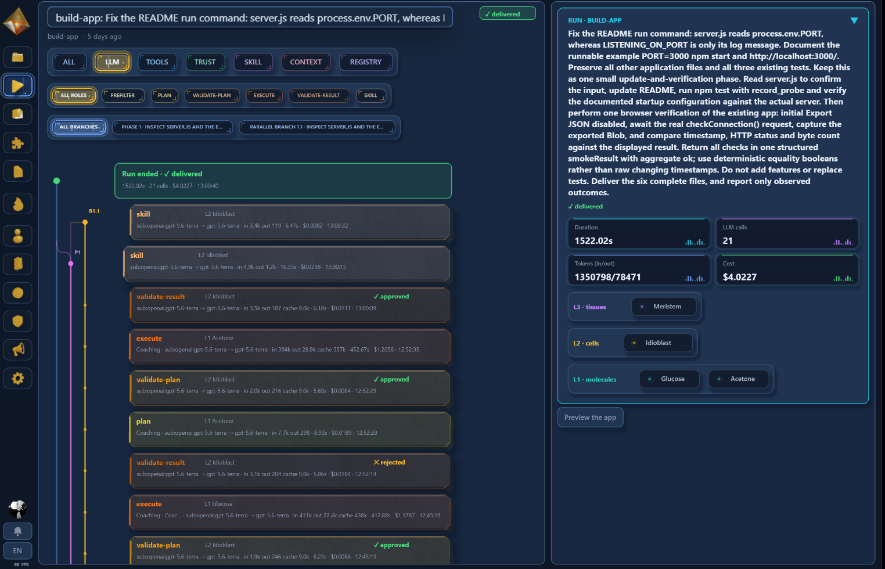

<div align="center">

# ⚛️ atoma

### Turn business ideas into working software.

Describe the tool your team needs. atoma coordinates AI agents to build it,
checks the result against what you asked for, and lets you inspect every step.

**[Open atoma.run →](https://atoma.run)**

[Demo](#watch-the-demo) · [Use cases](#what-could-your-team-build) · [A run, step by step](#a-run-step-by-step) · [Features](#features) · [How it works](#how-it-works) · [Self-host](#install-and-evaluate-it-locally) · [Documentation](#documentation)

[](https://github.com/mgtf/atoma/actions/workflows/ci.yml)
[](LICENSE)

</div>

> [!WARNING]
> **atoma is under active development.** Organisations are designed to be
> isolated from one another (projects, workspaces, traces and previews), but
> the platform has not been independently audited and we cannot yet guarantee
> that isolation, or the absence of other security defects, under every
> condition. **Do not include confidential, personal or otherwise sensitive
> data in your goals, uploaded files or generated applications**, whether on
> [atoma.run](https://atoma.run) or on a self-hosted instance exposed to others.
> Use the hosted service to evaluate the product, not to process data you could
> not afford to see leak. See [SECURITY.md](SECURITY.md) to report a vulnerability.

## Watch the demo

https://github.com/user-attachments/assets/481c59de-2f29-423e-a55c-80cc5b448b92

## From a business need to a tool you can use

An operations team needs a dashboard. An agency needs a client demo. A product
team needs an API prototype. atoma turns those requests into software: web
applications, HTTP APIs, command-line tools and their technical documentation.

Start at **[atoma.run](https://atoma.run)**. The web console brings projects,
AI execution, acceptance criteria, result previews, model choice and run history
into one place. This repository contains the open-source engine and console for
teams that want to inspect, extend or self-host them.

## What could your team build?

These are example project briefs, not prebuilt industry integrations or
customer deployment claims.

| Team or industry | Example project | What it helps you do |
| --- | --- | --- |
| Agencies & consulting | An interactive client demo or project estimator | Turn a proposal into something a client can try |
| Retail & e-commerce | A sales dashboard from exported CSV files | Explore product performance and share a clear view with the team |
| Logistics & operations | An inventory viewer or shipment-status prototype using sample data | Test a workflow before connecting operational systems |
| SaaS & product teams | A web app prototype or HTTP JSON API | Explore a feature and hand working code to engineering |
| Data & engineering teams | A CSV-to-JSON CLI, validation utility or technical documentation | Package a repetitive task into a reusable tool |

For example:

> Build a sales dashboard that lets me upload a CSV with date, product, region
> and revenue columns. Add filters, monthly totals and a chart by region.
> Include sample data and instructions to run it locally.

## A run, step by step

1. **Create a project**, from scratch or by importing an existing GitHub
   repository, and describe the outcome you want.
2. **Say what "done" means**, if you want to: list the behaviours the result
   must show. Otherwise the run drafts its own checklist from your goal.
3. **Follow the run** as agents plan, write files, start servers and check their
   work, with the model, tokens and cost behind every step.
4. **Preview web results** in a temporary, isolated environment, including a
   snapshot while the run is still building.
5. **Keep the deliverable**, with its verification record, and publish it to a
   connected GitHub repository. The project's next run continues from it.

Previews are review environments; deploying the generated application is a
separate step. Project runs use the configured model accounts and consume model
quota or incur API charges.

<p align="center">
  
</p>

<p align="center"><em>See what ran, what was checked, and where model usage went.</em></p>

<p align="center">
  
</p>

<p align="center"><em>Filter the timeline to LLM calls: the model, tokens and cost behind each step.</em></p>

## Features

### Acceptance criteria you approve before launch

A project run can carry up to twelve criteria, written one per line in the
console, the CLI (`--criteria <file>`) or over MCP. A line such as
`GET /api/items` is an HTTP check; any other line is judged by review. The host
stores the list before planning starts and nothing can change it afterwards.
The planner is told the user wrote it, and the final check is told which HTTP
checks were actually observed on servers the run itself started.

Without a list, the run drafts one from the goal with a single call to the
cheapest model. A drafted list can only add to what the final check looks for;
it can never make a run pass.

### Finished work is never thrown away

A run that exhausts its budget, or whose result the final check refuses after
one remediation attempt, is kept as **incomplete** rather than discarded. Its
finished phases stay in the workspace, and the console explains in plain
language why it stopped and what to do next, with the technical reasons one
click away. The project's next run starts from that workspace and is told why
the previous one stopped.

### Choose the models, then compare them

Each tier (workers, supervisors, planners) takes its own model selector, of the
form `<api|sub|own>:<vendor>:<model>`, across Anthropic, OpenAI, Z.ai and
Ollama: `api:` bills a key, `sub:` the host's Claude or ChatGPT subscription,
and `own:` the member's own ChatGPT account, whose available models Settings
lists. The operator can delegate the host subscription to named members without
making them administrators.

Every run records the models it was pinned to and the models the provider
actually served. Any delivered or incomplete project run can be **rerun on other
models**: same goal, same acceptance criteria, same starting workspace. The
rerun sits beside the project's history, so you can compare cost, time and
result; it never publishes and never seeds a later run.

### Start from your repository, publish back to it

Install the GitHub App to import a repository into a project or create a new
one, then publish delivered results to it. A project's earlier deliverables,
including Markdown, CSV, PDF and Office documents, are indexed so later runs
can search them and cite exact passages. See [GitHub App setup](docs/github-app-setup.md).

### Verification you can read

Supervisors check results with evidence the run produced: files, command
exit codes, HTTP probes, and browser checks laid out at the viewport widths the
goal asks for. They never replay shell commands a model wrote. Every verdict,
retry and refusal is in the timeline, and the console is available in thirteen
languages, on desktop and mobile.

### Connect an existing agent through MCP

The console serves an HTTP MCP endpoint at `https://<your-instance>/mcp`.
Compatible clients such as Claude Code or Codex can start runs, pass acceptance
criteria, request reruns and read traces, costs and diagnostics, with the same
organisation permissions as the web console.

**Thirty-nine tools.** The visible subset depends on the caller's role.
See the [MCP connection and authorization guide](docs/mcp-oauth.md).

### A platform that reviews its own runs

Three background services watch the platform itself. The **sentinel** watches
runs in flight for cost overruns and drifting trajectories. The **analyst**
writes a cited post-mortem verdict for each finished run. The **mender** turns a
verdict that names a code defect into a pull request, which a person reviews and
merges. Read the [supervisor design](docs/supervisor-design.md).

## How it works

atoma assigns planning, supervision and execution to different AI agents and
model tiers. Ordinary build runs start with a supervisor and workers; a deeper
planning tier takes over if supervision exhausts its retries, and a seeded run
keeps its starting workspace when it does.

- **Workers build.** They read and write files, run commands and use tools, in a
  container with no network unless egress is explicitly allowed.
- **Supervisors check.** They review results against artifact evidence and fixed
  probes. Before delivery, a separate check reviews the final result against
  the goal and its acceptance criteria.
- **Trust is earned.** Components that keep succeeding can skip some model
  reviews while retaining mechanical checks. A failure revokes that trust.
- **Skills carry forward.** Verified work becomes reusable recipes. Recipes are
  compiled into scripts only when a run continues existing work.

The composition model is **Element → Molecule → Cell → Tissue**: tools, workers,
supervisors and planners. Read **[How atoma works](docs/how-it-works.md)** for
the architecture, execution boundaries and verification design.

**One catalogue, shared by every run.** An instance keeps one agent registry,
one skill catalogue and one set of trust counters, and every run reads and
writes them, whichever organisation started it. What one team's run works out
is offered to the next team's run. Projects, workspaces, traces and searchable
documents stay scoped to their organisation. This is the design, and it has a
price: prompts and recipes a run writes, including wording derived from a
document it was given, are readable by other organisations' runs. An instance
therefore suits teams that accept pooling what their runs learn. The hosted
service states this in its [shared-learning terms](docs/platform-commons-terms.md).

## Install and evaluate it locally

For the web experience, start at **[atoma.run](https://atoma.run)**.
For a source checkout, use the pinned Node version and follow the
[development setup guide](docs/development-setup.md), including system
prerequisites. Runs and the full test suite require macOS or Linux; on Windows,
use WSL2 with its own checkout on ext4.

```bash
git clone https://github.com/mgtf/atoma.git
cd atoma
nvm install && nvm use
npm ci
npm run release:check
npm run doctor
```

Configure your model providers using [`.env.example`](.env.example) and the
[development guide](docs/development-setup.md), then run a task and open the
console:

```bash
npm run run:build -- "a Node CLI that converts CSV to JSON"
npm run viz:serve
```

The compiled commands read the process environment; they do not load `.env`.
The local console is open on loopback by default. Organisation-scoped project
runs additionally require Docker and a Haystack search runtime, described in
the [development setup guide](docs/development-setup.md).
A fresh checkout contains no learned state.

To host an instance for others, follow the [packaged stack](docs/packaged-stack.md),
[deployment](docs/automatic-deployment.md), [GitHub App](docs/github-app-setup.md)
and [preview](docs/preview-deployment.md) guides, and back the state up
off-machine with `npm run backup -- --dest <mount>`.

## Status

atoma is an evolving open-source system. Its web console, project runs,
acceptance criteria, comparison reruns, GitHub import and publication, result
previews and MCP endpoint are in use on [atoma.run](https://atoma.run).

Local file-tool containment is not shell isolation; use the container backend
for isolated execution. A platform admin can read across organisations, and
mutually untrusted tenants are not a supported deployment shape. Verification
provides evidence for review, not a guarantee that a generated application is
ready for production. See the [changelog](CHANGELOG.md) for what changed.

<details>
<summary>Repository facts</summary>

<!-- atoma:facts:begin -->
<!-- Generated from this checkout by `npm run docs:facts -- --apply`. Do not edit by hand. -->

| Read out of this checkout | |
| --- | --- |
| Version | `0.4.0` |
| Node | 24.20+ (`.nvmrc` 24.20.0, `engines` >=24) |
| Subsystems under their own contract | 18 |
| MCP tools | 39 |
| Curated agent names | 118 molecules · 40 cells · 20 tissues |
| Controlled benchmark rounds | 12 (`benchmark/RESULT.md` + `ROUND<n>.md`) |
| Interface locales | 13 catalogs — 1 source, 12 translated |

<!-- atoma:facts:end -->

</details>

## Documentation

| I want to… | Read |
| --- | --- |
| Understand the architecture | [How it works](docs/how-it-works.md) |
| Know what runs share with each other | [Shared-learning terms](docs/platform-commons-terms.md) |
| Use your own ChatGPT account | [Personal model discovery](docs/personal-model-discovery.md) |
| Develop locally or contribute | [Development setup](docs/development-setup.md) · [Contributing](CONTRIBUTING.md) |
| Operate a hosted instance | [Packaged stack](docs/packaged-stack.md) · [Deployment](docs/automatic-deployment.md) · [Maintenance](docs/project-maintenance.md) · [Configuration](.env.example) |
| Publish results or enable previews | [GitHub App](docs/github-app-setup.md) · [Preview deployment](docs/preview-deployment.md) |
| Connect an MCP client | [MCP authorization](docs/mcp-oauth.md) |
| Review changes | [Changelog](CHANGELOG.md) · [Code reviews](docs/code-reviews.md) |
| Report a vulnerability | [Security policy](SECURITY.md) |

## Historical measurements

**Twelve controlled rounds** compared atoma with a single frontier agent on
build and maintenance tasks. Results were mixed, and they predate the
2026-08-18 state reset, so they do not establish savings or correctness for the
current release. Read the [protocol](benchmark/PROTOCOL.md) and the
[results](benchmark/RESULT.md) for context.

## License

atoma is **free and open-source software** under the
[GNU Affero General Public License, version 3](LICENSE) (`AGPL-3.0-only`).
If you distribute a modified version, or run one that users interact with over
a network, you must offer those users its source under the same licence.
Unmodified use, including internal production use and hosting, carries no
obligation beyond keeping the notices. A commercial licence is available from
the author for organisations that cannot accept the AGPL; contributors grant
the rights that make this possible through the [CLA](CLA.md), which also
commits the project to remaining under an OSI-approved licence.

Contributions start with [`CONTRIBUTING.md`](CONTRIBUTING.md). Vulnerabilities
go through [`SECURITY.md`](SECURITY.md), not the issue tracker. The hosted
service at [atoma.run](https://atoma.run) publishes its
[shared-learning service terms and operator contact](docs/platform-commons-terms.md)
separately from the software licence.

Model providers are called with the credentials you supply, under each
provider's own terms. The `@anthropic-ai/claude-agent-sdk` dependency is
distributed by Anthropic under its own licence, and the 3D assets under
`src/viz/public/` carry their CC0 and CC-BY-4.0 notices beside the files.

Copyright 2026 Matthieu Foillard.

---

**[Explore atoma.run →](https://atoma.run)**
