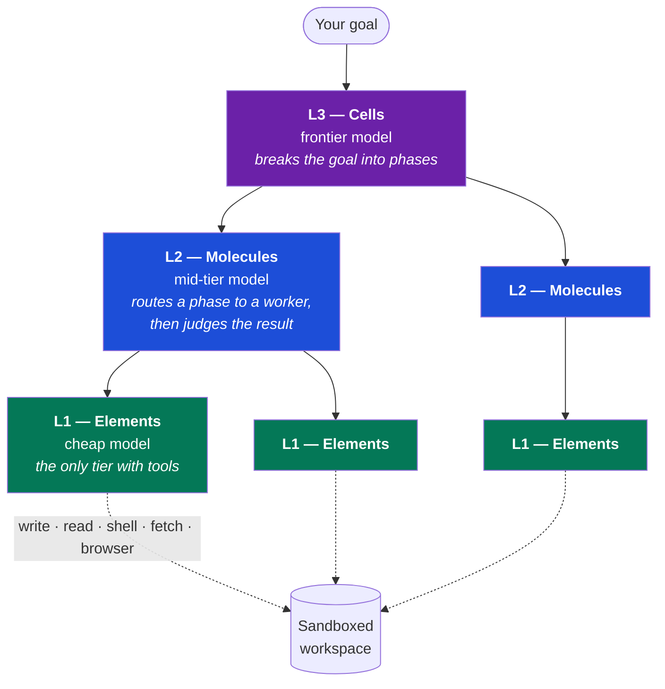
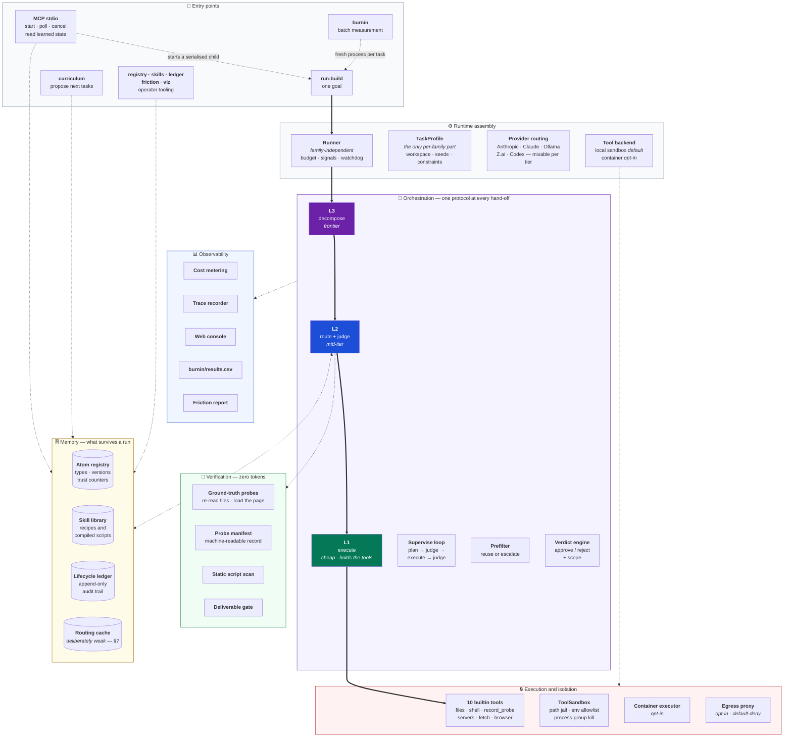
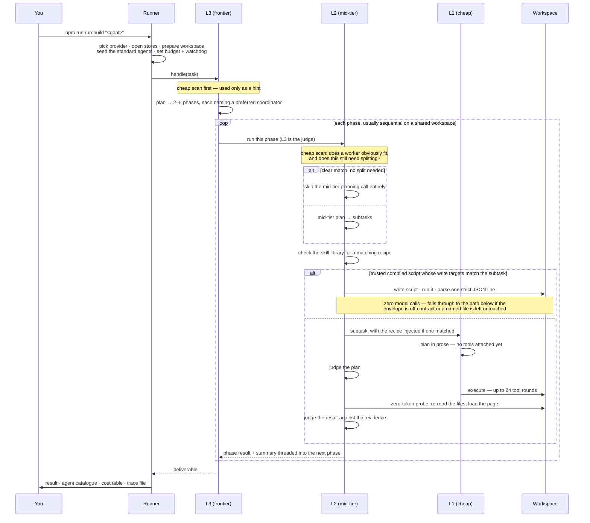
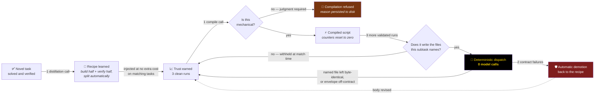
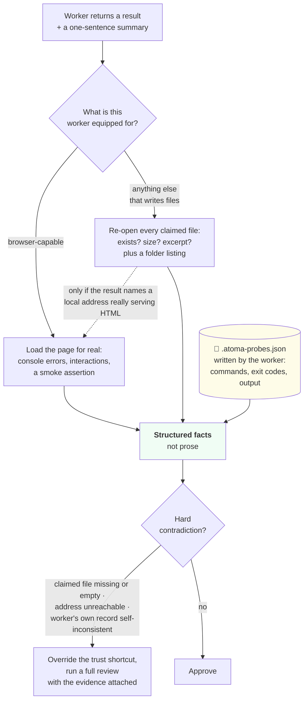
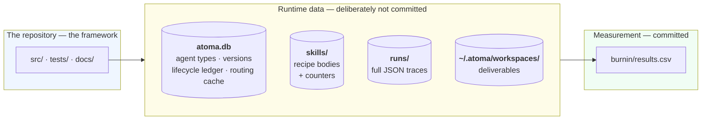

# How atoma works

*A high-level technical tour: the components, how they fit together, and what happens
during a run. Written for a CTO, an architect, or an engineer doing technical due
diligence — enough depth to judge the design, not enough to need the source open.*

[← back to the README](../README.md) · for the multi-tenant target state, see
[`saas-architecture.md`](saas-architecture.md) · for the engineering rationale behind
individual mechanisms, see `AGENTS.md` at the repository root.

---

## 1. The core idea

An *atom* is an agent backed by a language model. atoma arranges atoms in three tiers, and
the tiers differ in exactly two ways: **which model they run on**, and **whether they can
touch the outside world**.

Two consequences fall out of that split:

- **Cost is bounded by structure, not discipline.** On the SUPERVISED path only the bottom tier
  is handed atoma's tool executor, so supervisors cannot mutate the workspace through the
  framework. The one application-level exception is deliberate and labelled in code: after
  supervision has failed outright, a supervisor takes over for a last-resort turn. The Codex CLI
  transport is a narrower provider caveat: Codex cannot disable its own built-ins, so L2/L3 run
  read-only in an empty directory and may still perform internal read-only tool turns; Codex is
  structurally refused at L1.
- **Every hand-off is supervised.** The link from L3 to L2 and the link from L2 to L1 run the
  *same* protocol: plan → judge the plan → execute → judge the result. It is one implementation,
  never duplicated inside the agent classes.

---

## 2. The complete component map

### The bricks, in one line each

| Layer | Component | What it does |
|---|---|---|
| **Entry** | MCP over stdio | Thirteen tools: start, poll and cancel one cross-process-serialised run; read registry, skills, ledger, traces and friction |
| **Runtime** | Runner | Everything family-independent: provider choice, sandbox, budget, abort signals, watchdog, trace, post-mortem |
| | TaskProfile | The *only* per-family part: workspace prep, seed agents, task constraints |
| | Provider routing | Five provider routes over four transports; a tier can be pinned to a different vendor than its neighbours. Codex is L2/L3 only |
| **Orchestration** | L3 / L2 / L1 atoms | Decompose · route and judge · execute |
| | Supervise loop | The single plan→judge→execute→judge protocol, shared by both hand-offs |
| | Prefilter | A cheap-model scan answering "does something we already have fit this?" before any expensive call |
| | Verdict engine | Approve or reject, and at what scope: tweak this instance, amend the stored type, or branch a variant |
| **Memory** | Atom registry | SQLite table of agent types with full version history and trust counters |
| | Skill library | On-disk recipes and compiled scripts, with their own counters |
| | Lifecycle ledger | Append-only record of every trust change, written inside the same transaction as the change |
| | Routing cache | Memoises identical routing decisions (see §7 for why it is deliberately weak) |
| **Execution** | ToolSandbox | Path jail, credential-stripped child environment, throwaway HOME, process-group kill |
| | 10 builtin tools | Write, edit, read, list files; run a shell command; run-and-record a verification probe; start a static or Node server; fetch a URL; drive a headless browser |
| | Container executor | *Opt-in.* Tools run in a disposable container with only the workspace mounted and no network route |
| | Egress proxy | *Opt-in.* Per-run private network with a default-deny, anchored host allowlist |
| **Verification** | Ground-truth probes | Zero-token evidence gathering: re-read files, load the page, cross-check the worker's own record |
| | Probe manifest | `.atoma-probes.json` — machine-readable record of every verified invocation |
| | Static script scan | Deny-list over compiled script bodies before they are ever trusted. A hygiene filter with a known bypass — never cite it as a security control |
| | Deliverable gate | On the unsupervised path, every file the task asked for must exist — and, when the subtask used a mutating verb, must not be byte-identical afterwards. Existence alone was inert on maintenance work, where every file is seeded |
| **Observability** | Cost metering | One formula, used by both the run summary and the console, so they cannot disagree |
| | Trace recorder | Full JSON per run: every call, tool invocation, registry change and skill decision |
| | Web console | Replays any run; shows in-flight calls live |
| | Economics ledger | `burnin/results.csv`, one row per measured run |
| | Friction report | Offline scan of stored traces for recurring tool failures — no model calls |

---

## 3. Flow — a task, end to end

**What the judge actually does, in order** — this sequence is where most of the cost discipline
lives:

1. A plan the cheap router wrote itself is **auto-approved**. Asking a second cheap model to vet
   a one-line routing decision produces no new information, and was observed rejecting perfectly
   good freshly-created agents.
2. A **free mechanical check** rejects any plan promising tools the worker does not have. It runs
   *before* the trust shortcut, so a trusted child's out-of-scope plan is not waved through.
3. A child with a clean track record is **approved with no model call**.
4. Otherwise, a cheap-model verdict.

On the *result* side, step 3 is deliberately **not blind**: the zero-token reality probe runs
first, and a hard contradiction — a claimed file missing or empty, a page that will not load —
drops the decision through to a full review. The cheapest path is not allowed to be the least
verified one.

**When it goes wrong.** Three rejections, or the same complaint three times, raises an
escalation: the child's failure counter moves (revoking trust), a variant with narrower
instructions is created and given exactly one clean attempt, and if that also fails the parent
does the work itself — with the result explicitly stamped as fallback-produced so nobody
mistakes it for a normal delivery.

---

## 4. Flow — how a repeatable phase gets compiled away

The most speculative of the three mechanisms, and the one that has not yet paid: across eight
controlled rounds the compiled path fired 14 times, 11 of them in a single round whose
deliverables turned out wrong. The lifecycle below is sound and every step is guarded; what is
missing is demand for it on the task families measured so far. See
[`hybrid-skills-design.md`](hybrid-skills-design.md) for the most recent attempt to change
that — designed, measured and refused.

The loop is **asymmetric on purpose**. Promotion has to be earned twice — once by the recipe,
then again by the compiled script, whose counters are reset at compile time precisely because
the script is a brand-new artefact that has never executed. Demotion takes two failures. A
wrong script cannot entrench itself. A right one runs free *when it is matched to work it can
actually do* — and that, not correctness, is the binding constraint: in round 8 a fully trusted,
correct compiled script was withheld 14 times, every refusal justified, and dispatched zero
times.

**Splitting build from verify is what makes anything compilable at all.** A monolithic
"build and check it" recipe always gets refused, because the build half is irreducible
reasoning. Distilling the verification half separately is where most compiled scripts come from —
the measured catalogue produced most of its script forms this way. The remaining script forms
came from authoring recipes whose output was fully determined by the workspace, such as assembling
package metadata and documentation for an already-tested CLI.

**Field-proven, unattended — with a caveat about the evidence.** When a workspace's module
semantics broke a compiled verifier, the entire safety stack ran by itself across two runs —
dispatch, contract failure, failure streak, demotion to the recipe, an anti-recompile stamp with
the reason recorded — and every run still shipped via the supervised path while the system
quarantined its own broken optimisation. Only the outcome is reproducible from a committed
artefact: all eight runs of that batch read `delivered` in `burnin/results.csv`. The demotion
chain itself predates both the trace archive and the CSV columns that would show it, and
survives only as a narrative in `AGENTS.md`.

---

## 5. Flow — how a result is proven

The supervisor never takes the worker's word for it, and never re-runs the worker's commands
either. It gathers evidence with tools it owns.

Three design decisions worth flagging:

- **The probe costs zero tokens.** It is local file reads, or one page load. That is why it can
  afford to run on the most-trusted path.
- **It never fails a run on its own judgement.** It supplies facts; the reviewer decides. A
  path-extraction heuristic must not be able to fail a correct deliverable by itself.
- **Command replay was considered and rejected.** Re-running command strings the worker wrote
  would mean parsing model-authored shell out of prose, and execution is not idempotent — the
  verification could mutate the thing it verifies. Instead the *evidence format* was raised: the
  worker records what it observed in a machine-readable file, and the supervisor reads and
  cross-checks it.

**The manifest is the machine interface.** Its schemas, the instructions given to writers, the
instructions given to replaying scripts, and its health check are all generated from one module
whose examples are validated against the schemas at load time — so the four sides cannot drift
apart. That structure exists because the hand-written era produced two production incidents where
they did.

---

## 6. Where state lives

**One database, not several.** Agent types, their version history, the audit ledger and the
routing cache all live in a single SQLite file. That consolidation was recent and deliberate:
when the ledger was a sibling file, a counter and its audit event could be written in separate
steps, so an ill-timed crash left the integrity checker reporting a state that could not
otherwise occur. They now share a transaction.

**Recipes stay on disk, and that is a decision rather than an omission.** `SKILL.md` is the
portable interchange format — it can be read, grepped, hand-edited and exported to other agent
tooling verbatim. Moving it into the database is recorded as revisit-when-a-second-tenant-exists,
not as a to-do.

**A fresh clone starts at zero.** The trained state is data, not source. That is what makes the
cost curve a *measurement* — you can wipe everything and watch it regrow, which has been done
across several full resets.

---

## 7. The safety model — what is actually enforced

Stated plainly, because the distinction between default and opt-in matters.

**Enforced by default, locally:**

| Control | What it means |
|---|---|
| Path jail | File tools cannot escape the workspace — checked both by path arithmetic *and* by following symlinks to their real destination |
| Credential stripping | Spawned processes get an allowlisted environment and a throwaway HOME. The run's own API key is physically absent from anything the model starts |
| Process-group kill | Every server or browser started is reaped on any exit path, including a crash |
| Tool-scope enforcement | A tool the worker was not granted is refused by the transport and reported back inline — never executed |
| Output truncation | Oversized tool output is trimmed before being re-charged to the model on the next round |

**The honest limit.** In local mode the shell child is *not* jailed — it is started with the
workspace as its working directory and nothing more, so an absolute path reaches the rest of the
machine. The shell executable list is **steering, not a boundary**: `bash`, `node -e` and
`python3 -c` are all on it and each is a complete escape hatch. This is stated in the code and in
`AGENTS.md` rather than papered over.

**Opt-in, and this is what actually closes that gap:**

- `--container` runs every tool inside a disposable container with only the workspace mounted, no
  network route, all privileges dropped, and memory and CPU ceilings. The registry, the recipes
  and other runs' traces are simply *absent from that filesystem* — the path walk that works
  locally finds nothing. The container keeps its own loopback, so starting a server and probing
  it still works. Measured overhead: **~4ms per tool call, ~243ms container boot** — recorded in `AGENTS.md`
  from one session of three cold starts; no committed artefact regenerates it.
- `--egress` adds a per-run private network and a gate process with a default-deny, anchored host
  allowlist — raw IP addresses always refused, lookalike hosts refused by construction.

It is not the default, deliberately: local development is single-tenant, so the isolation would
protect the operator from nobody, while a real multi-tenant deployment would containerise always
rather than by flipping a flag.

**One weak mechanism, documented as weak.** The routing cache memoises identical routing
decisions. Measured over 748 real calls, only 13 were repeats — a **1.7% ceiling**, worth
$0.0003 per run. It is kept because it is cheap and honest about itself, and the code carries an
explicit warning against the obvious "fix": fuzzy matching would raise the hit rate by trading
the cache's only safety property — exactness — at the one point in the pipeline with no validator
above it.

---

## 8. Where the money goes

Per run, on a mature family:

| Slot | Model tier | Typical count | Note |
|---|---|---|---|
| Top-level plan | frontier | **1** | The single largest line item. A shortcut existed and was removed: collapsing it produced monolithic deliverables with no per-phase checkpoint |
| Routing scans | cheap | ~5–7 | One per phase; short-circuits the expensive call when something already fits |
| Mid-tier plans | mid | **0 on the happy path** | Skipped entirely when the routing scan finds a clear match |
| Reviews | cheap | 0 on trusted components | Replaced by the zero-token probe |
| Execution | cheap | the bulk of tokens | Long tool loops; prompt caching is monitored live in every run summary |
| Compiled phases | — | **0 calls**, but rare | Two tool calls and a strict JSON parse. Present in 45 of 156 corpus runs; across every committed controlled-run row it fired once in 54 build runs and 13 times in 30 maintenance runs |

**Prompt caching is load-bearing and monitored.** The system-level prompt is deliberately long
enough to clear the provider's minimum cacheable size; trimming it below that threshold silently
disables caching with no error. The cache-read column in the run summary is the operator's live
check that it is still working.

---

## 9. What is not built

Recorded so nobody has to discover it in a demo:

- **No tenancy of any kind.** No users, no organisations, no authentication. The web console
  binds to localhost and has no auth at all. The target design exists in
  [`saas-architecture.md`](saas-architecture.md) and is explicitly marked as not built.
- **No hosted service.** This is a private repository, not a published project.
- **The browser-based family cannot reach zero cost yet.** Compiled scripts have no browser, so
  the compiler correctly refuses to compile web-validation recipes. Every compiled script in the
  catalogue belongs to the command-line and documentation bucket; other families borrow them
  through the shared catalogue rather than owning any.
- **Partial replay does not exist.** When a multi-phase plan is rejected, the whole plan re-runs;
  there is no mechanism to keep the good phases and redo only the bad one.
- **Streaming, OpenTelemetry and external dashboards** are out of scope; observability is the
  in-process metrics summary, the JSON traces and the local console.

---

## 10. Reading further

| Question | Where |
|---|---|
| Why does mechanism X exist? | `AGENTS.md` — each entry names the observed failure that motivated it |
| What was tried and rejected? | `AGENTS.md` § *Considered and rejected* — with the measurements that settled it |
| What would multi-tenancy require? | [`saas-architecture.md`](saas-architecture.md) §5 invariants, §7 rules for today |
| What does a real run look like? | `npm run viz` — or `npm run viz:demo` for a mocked run with no API key |
| How does another agent drive atoma? | `npm run build`, then `claude mcp add atoma -s local -- node "$PWD/dist/mcp/stdio.js"` — stdio only, 13 tools |
| Are the economics real? | `burnin/results.csv`, regenerable with `npm run burnin` |
| …under a control? | `benchmark/PROTOCOL.md` — every round registered before it ran — and `benchmark/ROUND8.md` |
| Do the deliverables actually work? | `benchmark/results-round8-scores.json` is the committed historical 7-check output; `verify-maint.mjs` now has 10 checks, but the round workspaces needed to regenerate it are not committed. Rounds 4-7 have no committed scorer output |
